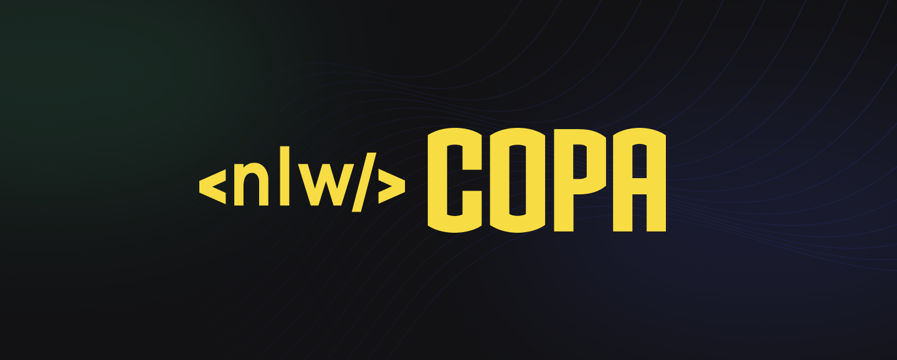

  
  
  
  
  

 

  <a href="https://github.com/RodrigoLuigi/NLW-Copa/tree/main/server#top">API</a> &#xa0; | &#xa0; 
  <a href="https://github.com/RodrigoLuigi/NLW-Copa/tree/main/copa-card#top">Copa-Card Web</a> &#xa0; | &#xa0;
  <a href="https://github.com/RodrigoLuigi/NLW-Copa/tree/main/web#top">Web</a> &#xa0; | &#xa0;
  <a href="https://github.com/RodrigoLuigi/NLW-Copa/tree/main/mobile#top">Mobile</a> &#xa0; | &#xa0;

##  _**O que desenvolvemos neste Projeto?**_

NLW Copa - é um aplicativo para criar bolões descentralizados dos Jogos da Copa do Mundo. O usuário poderá criar seu próprio bolão e compartilhar o código de acesso para que outros usuários possam participar. Cada usuário poderá dar apenas um único palpite sobre cada jogo.

<h2>
Copa-Card Web
</h2>

